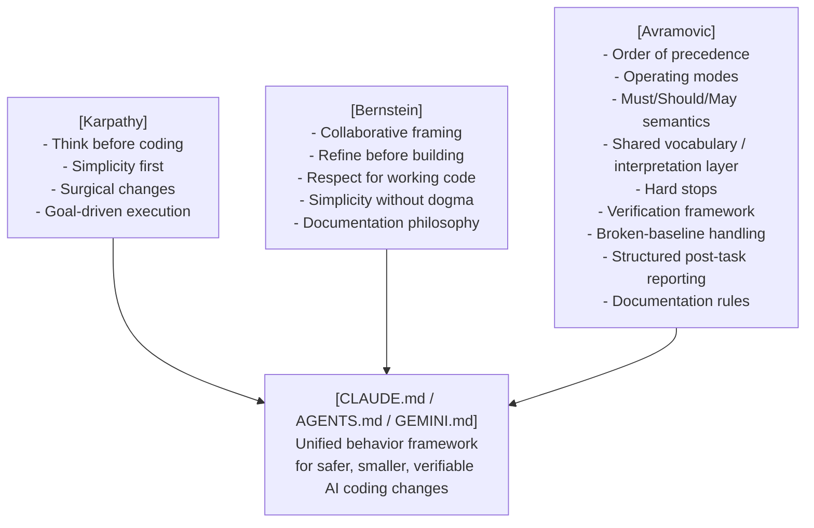

# AI Behaving Instructions That Work

[](https://zeljkoavramovic.github.io/behave/)

One file. Zero dependencies. Discipline every AI coding session.

## Overview

Instructions that make AI coding assistants actually behave, so every coding session becomes more disciplined, more predictable, and more productive.

The ideas come from **[Andrej Karpathy's](https://x.com/karpathy/status/2015883857489522876)** observations on LLM coding pitfalls (**[Multica adaptation](https://github.com/multica-ai/andrej-karpathy-skills)**), and from **[David Scott Bernstein's](https://github.com/ThePassionateProgrammer/knowledge-base-starter)** partnership-driven working-agreement style. From there it grew into something more systematic, tuned for real projects.

Supports **Claude Code**, **Codex**, **Cursor**, **OpenCode**, **Kilo Code**, **Cline**, **Antigravity**, **Pi**, **DeepSeek Harness**, **ZCode**, **OpenClaw**, **Hermes**, and 40 other agents. The installer lets you choose from the list of auto-detected agents and asks whether you want a global install or a project-directory install. Depending on the kind of agent, installer drops the behaving instructions file into the agent's rules directory, or injects into `CLAUDE.md`, `AGENTS.md`, or `GEMINI.md`. No dependencies, one file, and simple deinstallation if needed.

A **[single-page walkthrough](https://zeljkoavramovic.github.io/behave/)** adds visual diagrams, side navigation, a before/after comparison, a feature comparison table, an FAQ, and one-click install commands.

## The problem it solves

AI coding assistants, left unchecked, tend to:

- Start coding before clarifying ambiguous requirements
- Add unrequested features, abstractions, and "improvements"
- Expand scope mid-task, refactor while fixing or "improve" while adding
- Silently rename files, change APIs, or rewrite working code
- Skip verification until after the mistake is already in the diff
- Suppress errors without telling you
- Push to version control or delete files without warning
- Run destructive CLI commands or modify secrets with no safety gate
- Ship incomplete or stub implementations and call them done
- Pick arbitrarily when rules conflict, choosing helpfulness over safety

This file encodes behavioral contracts that prevent all of these.

## Key features

### Four core coding principles

The framework rests on four disciplines: think before coding, prefer simplicity, make surgical changes, and define success through verification. Everything else builds on these four.

### Collaborative working model

The human brings domain knowledge and architectural intent. The AI brings speed, pattern recognition, critique, and exploration. The AI is expected to refine ideas collaboratively and wait for an explicit boundary before building.

### Order of precedence

When rules conflict, the AI knows exactly which wins. Hard stops override everything unless explicitly authorized; explicit instruction overrides defaults; correctness and safety override elegance or speed.

### Three named operating modes

- **default mode**: make the smallest correct change that satisfies the request
- **ambiguity mode**: stop and ask when uncertainty affects behavior, interfaces, data, safety, or irreversible work
- **cleanup mode**: broader simplification and deletion are allowed only when explicitly requested

That gives the AI an operating model instead of leaving behavior to chance.

### Wording conventions (Must / Should / May)

RFC-style rule weight removes ambiguity. `Must/Never` means mandatory, `Should/Prefer` means strong default, and `May` means optional.

### Shared vocabulary / interpretation layer

The file defines terms like *trivial task*, *minor ambiguity*, *harmful pattern*, and *working code* so the user and the AI share vocabulary from the start.

### Scope control for existing code

This is the most practical protection in the file. It prevents the AI from touching adjacent code, silently expanding scope, rewriting working systems, or using cleanup as an excuse to change unrelated areas.

### Hard stops with rule citation and authorization gate

When the AI cannot proceed, it does not just stop. It explains which rule caused the stop, so there is an audit trail around dangerous actions like destructive CLI commands, secret modification, silent signature changes, swallowed errors, or incomplete delivery, and it does not proceed until you authorize an exception.

### Verification by task type with manual fallback

Different work requires different proof:

- **Bug fix**: reproduce the failing case, then make it pass
- **New feature**: verify the public interface, not internals
- **Refactor**: verify observable behavior before and after
- **No automated tests**: define manual verification steps explicitly before proceeding

### Broken baseline handling

If the baseline is already broken, the AI must say so before making changes, define success relative to the existing state, and avoid pretending the whole system is verified when unrelated failures remain.

### Structured post-task report

After any non-trivial task, the AI reports:
- What changed
- What was verified
- What remains unverified
- Problems noticed but intentionally left untouched

### Documentation philosophy and rules

Documentation gets the same discipline as code. Explain the why. Update docs when behavior changes. Skip comments that just repeat the code, because they rot faster than the code they describe.

## Fully agnostic by design

This file works regardless of your:

| Dimension | Agnostic |
|---|---|
| Programming language | ✅ Python, C, JS, TypeScript, C#, Java, Pascal, Rust… |
| Framework | ✅ React, Django, Qt, bare-metal… |
| Library | ✅ No dependencies referenced |
| AI tool | ✅ 52 agents directly supported, adaptable to any instruction-file agent |
| OS | ✅ Windows, Linux, macOS |
| Domain | ✅ Web, embedded, desktop, scripts, data |
| Project type | ✅ New projects, legacy code, refactors |
| Verification method | ✅ Automated tests, manual validation, reproducible checks, baseline comparison |

Put project-specific stack details in a project-level instruction file. Keep the global file universal.

## How it comes together



## How it differs from the originals

| Feature | Karpathy | Bernstein | This repo |
|---|---|---|---|
| Core coding rules | ✅ | partial | ✅ inherited + refined |
| Collaborative partnership framing | ❌ | ✅ | ✅ inherited + refined |
| Order of precedence | ❌ | ❌ | ✅ new |
| Operating modes | ❌ | ❌ | ✅ new |
| Must/Should/May wording conventions | ❌ | ❌ | ✅ new |
| Shared vocabulary / interpretation layer | ❌ | ❌ | ✅ new |
| Existing-code scope discipline | partial | partial | ✅ formalized |
| Hard stops with rule citation | ❌ | ❌ | ✅ new |
| Hard-stop explanation protocol | ❌ | ❌ | ✅ new |
| Verification by task type | ❌ | partial | ✅ formalized |
| Verification fallback to manual steps | ❌ | ❌ | ✅ new |
| Broken-baseline handling | ❌ | ❌ | ✅ new |
| Structured post-task reporting | ❌ | ❌ | ✅ new |
| Dedicated documentation rules | ❌ | partial | ✅ formalized |
| Full multi-dimensional agnosticism | partial | partial | ✅ made explicit |

## Installation

The repo ships two files. `BEHAVE.md` is the instructions file itself - pure Markdown, zero dependencies, and `install.py` is the installer - a single cross-platform Python script, using standard library only, which injects the instructions into each supported agent.

### Installer (recommended)

Any OS with Python (3.6+) - runs straight from the repo:

**Windows (CMD and PowerShell):**

```powershell
python -c "import urllib.request; exec(compile(urllib.request.urlopen('https://raw.githubusercontent.com/zeljkoavramovic/behave/master/install.py').read(), 'install.py', 'exec'), {'__file__': 'install.py', '__name__': '__main__'})"
```

**Linux / macOS:**

```bash
python3 -c "import urllib.request; exec(compile(urllib.request.urlopen('https://raw.githubusercontent.com/zeljkoavramovic/behave/master/install.py').read(), 'install.py', 'exec'), {'__file__': 'install.py', '__name__': '__main__'})"
```

Append any documented flags at the very end of the whole command, after the final `"` that closes the `python -c "…"` part - the shape is `python -c "<script>" --list`, or `python -c "<script>" --remove --yes` to uninstall. No registry, no account, no npm - one Python script, standard library only, `BEHAVE.md` instructions file source resolution: an explicit `--source`, else a `BEHAVE.md` next to `install.py`, else a fetch of `BEHAVE.md` from the canonical GitHub URL.

Prefer a local copy of the script for easier playing with parameters? Here you go:

**Windows (CMD):**

```bat
curl -fsSL https://raw.githubusercontent.com/zeljkoavramovic/behave/master/install.py -o install.py && python install.py
```

**Windows (PowerShell):**

```powershell
iwr "https://raw.githubusercontent.com/zeljkoavramovic/behave/master/install.py" -OutFile install.py; python install.py
```
**Linux / macOS:**

```bash
curl -fsSL https://raw.githubusercontent.com/zeljkoavramovic/behave/master/install.py -o install.py && python3 install.py
```

The installer asks where the instruction should apply (to all of your projects or just to the one in current directory), auto-detects your installed agents, shows exactly what will change, and asks before writing.

**Supported agents list (52):**

Claude Code, Codex, OpenCode, Pi, Oh My Pi, Devin, Cursor, Gemini CLI, GitHub Copilot, Roo Code, Augment Code, Kilo Code, Droid, Deep Agents, Cline, Crush, Amp, Goose, Zed, OpenHands, Warp, Junie, Posit Assistant, ZCode, OpenClaw, Kimi Code, Qwen Code, Trae, Antigravity, Kiro, Qoder, Grok Build, Mistral Vibe, Rovo Dev, IBM Bob, Trae CN, Cortex Code, Antigravity CLI, Xum, Hermes Agent, AiderDesk, ForgeCode, Command Code, Qoder CN, Tabnine CLI, Codewhale, jcode, Codebuff, Kimchi, Pochi, Reasonix, and DeepSeek Harness

Run `python install.py --list` to see every agent it detects on your machine. For headless or CI use, see `python install.py --help`. In the agent picker, a checked row for an agent that already has the instructions installed shows `[X]` instead of `[x]` - the mark follows the checkbox as you toggle it, and re-running with it checked updates the existing install. Terminals without arrow-key support (or piped input) get the same cue in the numbered fallback as an `(installed)` suffix on the row.

**What the installer writes** (and why re-running is safe):

- **Inline mode**: a marked block (`<!-- BEGIN behave ... -->` down to `<!-- END behave -->`) at the TOP of the agent's memory file (`AGENTS.md`, `CLAUDE.md`, `GEMINI.md`, and friends). Everything you already had survives below the block, and a re-run replaces only the block itself.
- **Drop mode**: a standalone rules file the installer owns, placed in the agent's rules directory (for example `~/.claude/rules/behave.md`); removal deletes the file.
- **Plain copy**: `--copy-only` writes a bare `BEHAVE.md` and touches nothing else (not tracked by `--remove`).

For Claude Code at user scope the default is the drop file `~/.claude/rules/behave.md`; manually pass `--mode inline` for a marked block inside `~/.claude/CLAUDE.md` instead, or choose proper destination using the installer.

**Updating**: Re-run the installer UI, or use`python install.py --all-detected --yes` to update instructions for every agent it detects on the machine. If you put your customized `BEHAVE.md` next to installer, it will be used instead of the repo version.

**Uninstalling:**  Use `python install.py --remove` -to list agents with already installed instructions (without actual removal), and combine it with `--yes` for actual removal. Optionally, use `--agent` / `--scope` to narrow the scan.

For copying the file by hand, the next section shows exactly what to rename and where.

Cross-agent bonus: Devin, VS Code GitHub Copilot, and OpenCode (with Oh My Open Agent plugin) also read `~/.claude/CLAUDE.md` and `~/.claude/rules/`, so a Claude Code install reaches those agents for free. Others, like Oh My Pi (omp) keep their own config root (`~/.omp/agent/AGENTS.md`) and do not read Claude Code global file by default, so the installer gives them a dedicated target.

### Manual install

`BEHAVE.md` is plain Markdown, so manual installation is just getting its content to wherever your agent reads instructions. Three ways to do it, from most to least permanent.

#### 1. Copy the file, rename it, put it where your agent reads it

Download `BEHAVE.md` from the repo (or copy its content into a new file), rename it to the name your agent expects, and place it user-wide (applies to all your projects) or project-wide (applies to one repository):

| Agent | File name | User-wide location | Project-wide location |
|---|---|---|---|
| Claude Code | `CLAUDE.md` | `~/.claude/CLAUDE.md` | `CLAUDE.md` in repo root (or `.claude/rules/behave.md`) |
| Codex | `AGENTS.md` | `~/.codex/AGENTS.md` | `AGENTS.md` in repo root |
| OpenCode | `AGENTS.md` | `~/.config/opencode/AGENTS.md` | `AGENTS.md` in repo root |
| Gemini CLI | `GEMINI.md` | `~/.gemini/GEMINI.md` | `GEMINI.md` in repo root |
| Cursor | `AGENTS.md` | `~/.cursor/rules/behave.mdc` (add `alwaysApply: true` frontmatter) | `AGENTS.md` in repo root |
| Most other agents | `AGENTS.md` | the agent's global config directory | `AGENTS.md` in repo root |

User-wide example for Claude Code on Windows (PowerShell):

```powershell
mkdir -Force "$HOME\.claude" > $null; cp "$HOME\.claude\CLAUDE.md" "$HOME\.claude\CLAUDE.bkp" 2>$null; iwr "https://raw.githubusercontent.com/zeljkoavramovic/behave/master/BEHAVE.md" -OutFile "$HOME\.claude\CLAUDE.md"
```

User-wide example for Codex on Linux / macOS (same pattern for any `AGENTS.md` agent, just a different directory):

```bash
mkdir -p ~/.codex; cp ~/.codex/AGENTS.md ~/.codex/AGENTS.bkp 2>/dev/null; curl -fsSL https://raw.githubusercontent.com/zeljkoavramovic/behave/master/BEHAVE.md -o ~/.codex/AGENTS.md
```

Project-wide is the same copy under the right name inside your repo, for example from the project root:

```bash
cp AGENTS.md AGENTS.bkp 2>/dev/null; curl -fsSL https://raw.githubusercontent.com/zeljkoavramovic/behave/master/BEHAVE.md -o AGENTS.md
```

A file copy replaces the whole target file, so each command above saves an existing one as `<name>.bkp` first (silently skipped when there is nothing to back up). To merge with existing content instead, use the next option.

#### 2. Inject the content into an existing instructions file

If your `CLAUDE.md`, `AGENTS.md`, or `GEMINI.md` already has content worth keeping, open it and paste the `BEHAVE.md` content in (at the top is a good default), then save. This merges behave with your existing rules instead of replacing them. Installer also does that but puts BEGIN/END marks so content can be later removed or updated.

Alternatively, Claude Code users can put @BEHAVE.md (or @AGENTS.md - to load content from the file in the same directory) at the top of their existing CLAUDE.md and keep their CLAUDE.md clean. The reason why installer does not do it is because @ command is recognized only by Claude Code, and it would confuse some agents. Even cleaner is to drop BEHAVE.md into Claude rules directory where it is always loaded from (both user wide and project wide) - which is what installer offers.   

#### 3. Paste it straight into a session

Install nothing: copy the `BEHAVE.md` content and paste it into a new agent or chat session as your first message, or into the agent's custom-instructions field. The rules then apply to that session only. This is a good way to test before use.

Manual installs carry no installer markers: `--remove` cannot see or clean them, and a later installer run adds its marked block on top rather than adopting the file. Prefer the installer when possible: it handles the per-agent file naming automatically, is idempotent, and only the files it writes are tracked by `--remove`.

## Related projects

- **[Agentic Design Patterns](https://zeljkoavramovic.github.io/agentic-design-patterns/)**: an interactive tutorial on patterns for building intelligent AI systems. It covers core patterns (prompt chaining, routing, parallelization, tool use, code-then-execute, dynamic scaffolding), reasoning and strategy patterns (reflection, planning, reasoning techniques, parallel fusion, prioritization, exploration and discovery), orchestration patterns (multi-agent collaboration, goal setting and monitoring, inter-agent communication, awareness, resource-aware optimization), infrastructure and state patterns (memory management, learning and adaptation, model context protocol, knowledge retrieval and RAG, evaluation and monitoring, session isolation), and reliability and control patterns (the stop hook, exception handling and recovery, human-in-the-loop, the Ralph Wiggum loop, guardrails and safety, spec-first agent). Each pattern comes with a description, diagram, when-to-use guidance, where it fits in the bigger picture, pros and cons, and real-world examples. A visual relationship diagram shows how the patterns interconnect.

## Credits

- **[Andrej Karpathy](https://x.com/karpathy/status/2015883857489522876)** - observations on LLM coding pitfalls
- **[Multica](https://github.com/multica-ai/andrej-karpathy-skills)** - CLAUDE.md adaptation of Karpathy's principles
- **[David Scott Bernstein](https://github.com/ThePassionateProgrammer)** - partnership-driven working-agreement style
- **[Zeljko Avramovic](https://github.com/zeljkoavramovic)** - systematization and expansion: precedence model, operating modes, wording semantics, shared vocabulary layer, verification framework, hard-stop protocol, broken-baseline handling, task reporting, documentation rules

## Support the project

If this saved you time, frustration, or a bad deployment, support is welcome:

- ⭐ **Star the repository**
- 💬 **Share the repository**
- <a href="https://buymeacoffee.com/cupofavra" target="_blank">
     
   </a>

## License

MIT - use freely, improve openly, credit kindly.
