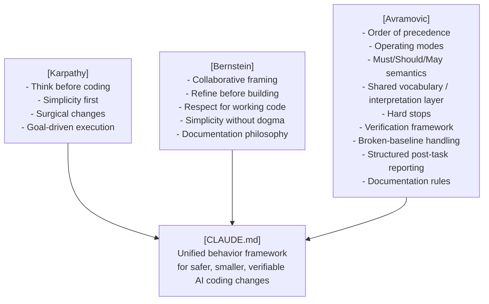

# CLAUDE.md That Works

[](https://zeljkoavramovic.github.io/karpathy-bernstein-avramovic/)

One file. Zero dependencies. Discipline every AI coding session.

## Overview

A global `CLAUDE.md` that makes AI coding assistants actually behave, so every coding session becomes more disciplined, more predictable, and more productive.

It works natively with **Claude Code** and **OpenCode**. For other agent tools, reuse the same framework through their preferred instruction file convention, such as `AGENTS.md` or `GEMINI.md`. No setup, no dependencies, one file.

The ideas come from **[Andrej Karpathy's](https://x.com/karpathy/status/2015883857489522876)** observations on LLM coding pitfalls (**[Multica adaptation](https://github.com/multica-ai/andrej-karpathy-skills)**), and from **[David Scott Bernstein's](https://github.com/ThePassionateProgrammer/knowledge-base-starter)** partnership-driven working-agreement style. From there it grew into something more systematic, tuned for real projects.

There is also a **[single-page walkthrough](https://zeljkoavramovic.github.io/karpathy-bernstein-avramovic/)** - with visual diagrams, side navigation, before/after comparison, feature comparison table, FAQ accordion, and one-click install commands.

## The problem it solves

AI coding assistants, left unchecked, tend to:

- Start coding before clarifying ambiguous requirements
- Add unrequested features, abstractions, and "improvements"
- Expand scope mid-task, refactor while fixing or "improve" while adding
- Silently rename files, change APIs, or rewrite working code
- Skip verification until after the mistake is already in the diff
- Suppress errors without telling you
- Push to version control or delete files without warning
- Run destructive CLI commands or modify secrets with no safety gate
- Ship incomplete or stub implementations and call them done
- Pick arbitrarily when rules conflict, choosing helpfulness over safety

This file encodes behavioral contracts that prevent all of these before they happen.

## Key features

### Four core coding principles

The framework rests on four disciplines: think before coding, prefer simplicity, make surgical changes, and define success through verification. Everything else builds on these four.

### Collaborative working model

The human brings domain knowledge and architectural intent. The AI brings speed, pattern recognition, critique, and exploration. The AI is expected to refine ideas collaboratively and wait for an explicit boundary before building.

### Order of precedence

When rules conflict, the AI knows exactly which wins. Hard stops override everything unless explicitly authorized, then explicit instruction overrides defaults, then correctness and safety override elegance or speed.

### Three named operating modes

- **default mode**: make the smallest correct change that satisfies the request
- **ambiguity mode**: stop and ask when uncertainty affects behavior, interfaces, data, safety, or irreversible work
- **cleanup mode**: broader simplification and deletion are allowed only when explicitly requested

That gives the AI an operating model instead of leaving behavior to chance.

### Wording conventions (Must / Should / May)

RFC-style rule weight removes ambiguity. `Must/Never` means mandatory, `Should/Prefer` means strong default, and `May` means optional.

### Shared vocabulary / interpretation layer

The file defines terms like *trivial task*, *minor ambiguity*, *harmful pattern*, and *working code* so the user and the AI share vocabulary from the start.

### Scope control for existing code

This is the most practical protection in the file. It prevents the AI from touching adjacent code, silently expanding scope, rewriting working systems, or using cleanup as an excuse to change unrelated areas.

### Hard stops with rule citation and authorization gate

When the AI cannot proceed, it does not just stop. It explains which rule caused the stop, so there is an audit trail around dangerous actions like destructive CLI commands, secret modification, silent signature changes, swallowed errors, or incomplete delivery. When a hard stop applies, it says so explicitly, states which rule triggers it, and does not proceed until you authorize an exception.

### Verification by task type with manual fallback

Different work requires different proof:

- **Bug fix**: reproduce the failing case, then make it pass
- **New feature**: verify the public interface, not internals
- **Refactor**: verify observable behavior before and after
- **No automated tests**: define manual verification steps explicitly before proceeding

### Broken baseline handling

If the baseline is already broken, the AI must say so before making changes, define success relative to the existing state, and avoid pretending the whole system is verified when unrelated failures remain.

### Structured post-task report

After any non-trivial task, the AI reports:
- What changed
- What was verified
- What remains unverified
- Problems noticed but intentionally left untouched

### Documentation philosophy and rules

Documentation gets the same discipline as code. Explain the why. Update docs when behavior changes. Skip comments that just repeat the code, because they rot faster than the code they describe.

## Fully agnostic by design

This file works regardless of your:

| Dimension | Agnostic |
|---|---|
| Programming language | ✅ Python, C, JS, TypeScript, C#, Java, Pascal, Rust… |
| Framework | ✅ React, Django, Qt, bare-metal… |
| Library | ✅ No dependencies referenced |
| AI tool | ✅ Claude Code, OpenCode, and adaptable to other instruction-file tools |
| OS | ✅ Windows, Linux, macOS |
| Domain | ✅ Web, embedded, desktop, scripts, data |
| Project type | ✅ New projects, legacy code, refactors |
| Verification method | ✅ Automated tests, manual validation, reproducible checks, baseline comparison |

Put project-specific stack details in a project-level instruction file. Keep the global file universal.

## How it comes together



## How it differs from the originals

| Feature | Karpathy | Bernstein | This repo |
|---|---|---|---|
| Core coding rules | ✅ | partial | ✅ inherited + refined |
| Collaborative partnership framing | ❌ | ✅ | ✅ inherited + refined |
| Order of precedence | ❌ | ❌ | ✅ new |
| Operating modes | ❌ | ❌ | ✅ new |
| Must/Should/May wording conventions | ❌ | ❌ | ✅ new |
| Shared vocabulary / interpretation layer | ❌ | ❌ | ✅ new |
| Existing-code scope discipline | partial | partial | ✅ formalized |
| Hard stops with rule citation | ❌ | ❌ | ✅ new |
| Hard-stop explanation protocol | ❌ | ❌ | ✅ new |
| Verification by task type | ❌ | partial | ✅ formalized |
| Verification fallback to manual steps | ❌ | ❌ | ✅ new |
| Broken-baseline handling | ❌ | ❌ | ✅ new |
| Structured post-task reporting | ❌ | ❌ | ✅ new |
| Dedicated documentation rules | ❌ | partial | ✅ formalized |
| Full multi-dimensional agnosticism | partial | partial | ✅ made explicit |

## Installation

**Windows (PowerShell):**

```powershell
mkdir -Force "$HOME\.claude" > $null; cp "$HOME\.claude\CLAUDE.md" "$HOME\.claude\CLAUDE.backup.md" 2>$null; iwr "https://raw.githubusercontent.com/zeljkoavramovic/karpathy-bernstein-avramovic/master/CLAUDE.md" -OutFile "$HOME\.claude\CLAUDE.md"
```

**Linux / macOS:**

```bash
mkdir -p ~/.claude; cp ~/.claude/CLAUDE.md ~/.claude/CLAUDE.backup.md 2>/dev/null; curl -fsSL https://raw.githubusercontent.com/zeljkoavramovic/karpathy-bernstein-avramovic/master/CLAUDE.md -o ~/.claude/CLAUDE.md
```

If `~/.claude/CLAUDE.md` already exists, it is backed up to `CLAUDE.backup.md` before being overwritten.

Works natively with **Claude Code** and **OpenCode**. For other AI coding tools, follow that tool's instruction file convention (for example `AGENTS.md` or `GEMINI.md`). The content is the same; the filename depends on the tool.

## Related projects

- **[Agentic Design Patterns](https://zeljkoavramovic.github.io/agentic-design-patterns/)**: an interactive tutorial on patterns for building intelligent AI systems. It covers core patterns (prompt chaining, routing, parallelization, tool use, code-then-execute, dynamic scaffolding), reasoning and strategy patterns (reflection, planning, reasoning techniques, parallel fusion, prioritization, exploration and discovery), orchestration patterns (multi-agent collaboration, goal setting and monitoring, inter-agent communication, awareness, resource-aware optimization), infrastructure and state patterns (memory management, learning and adaptation, model context protocol, knowledge retrieval and RAG, evaluation and monitoring, session isolation), and reliability and control patterns (the stop hook, exception handling and recovery, human-in-the-loop, the Ralph Wiggum loop, guardrails and safety, spec-first agent). Each pattern comes with a description, diagram, when-to-use guidance, where it fits in the bigger picture, pros and cons, and real-world examples. A visual relationship diagram shows how the patterns interconnect.

## Credits

- **[Andrej Karpathy](https://x.com/karpathy/status/2015883857489522876)** - observations on LLM coding pitfalls
- **[Multica](https://github.com/multica-ai/andrej-karpathy-skills)** - CLAUDE.md adaptation of Karpathy's principles
- **[David Scott Bernstein](https://github.com/ThePassionateProgrammer)** - partnership-driven working-agreement style
- **[Zeljko Avramovic](https://github.com/zeljkoavramovic)** - systematization and expansion: precedence model, operating modes, wording semantics, shared vocabulary layer, verification framework, hard-stop protocol, broken-baseline handling, task reporting, documentation rules


## Support the project

If this saved you time, frustration, or a bad deployment, support is welcome:

- ⭐ **Star the repository**
- 💬 **Share the repository**
- <a href="https://buymeacoffee.com/cupofavra" target="_blank">
     
   </a>

## License

MIT - use freely, improve openly, credit kindly.
